<!-- Header -->

  

<!-- Social Links -->

  
  
  

 

## About

Building AI products that matter.

**CTO @ [Rivetta](https://rivetta.io)** — Designing context engineering architectures for AI-powered K-webnovel translation. While many claim LLMs have "solved" translation, real-world demands prove otherwise: readers need cultural nuance and domain expertise that raw AI cannot deliver. I architect systems that bridge this gap.

**CEO @ [AlphaView](https://alphaview.kr)** — AI-driven stock news analysis platform.

---

## What I Do

<table>
<tr>
<td width="50%" valign="top">

### Rivetta
**CTO** — K-Webnovel AI Translation

Translating Korean webnovels for the US market. LLMs alone fail to satisfy readers—lacking domain knowledge and cultural understanding. I design **context engineering architectures** that deliver translations readers actually want.

</td>
<td width="50%" valign="top">

### AlphaView
**CEO** — AI Stock Analysis

Building [alphaview.kr](https://alphaview.kr), an AI-powered platform that analyzes stock news and market signals to help investors make informed decisions.

</td>
</tr>
</table>

---

## Background

| | Experience | Focus |
|:---:|:---|:---|
| 📚 | **8 Years** Literary Translation | Novels, webtoons, creative content |
| 🔧 | **3 Years** Technical Translation | Documentation, ML papers, technical specs |

> *"This domain expertise informs my approach to AI systems that truly understand context—something raw LLMs consistently fail to achieve."*

---

## Achievements

 

-00d084?style=flat-square&labelColor=0a0a0a)

---

## Tech Stack

  

---

## GitHub Stats

  
  

---

  Building the future of AI-powered translation and financial analysis.

