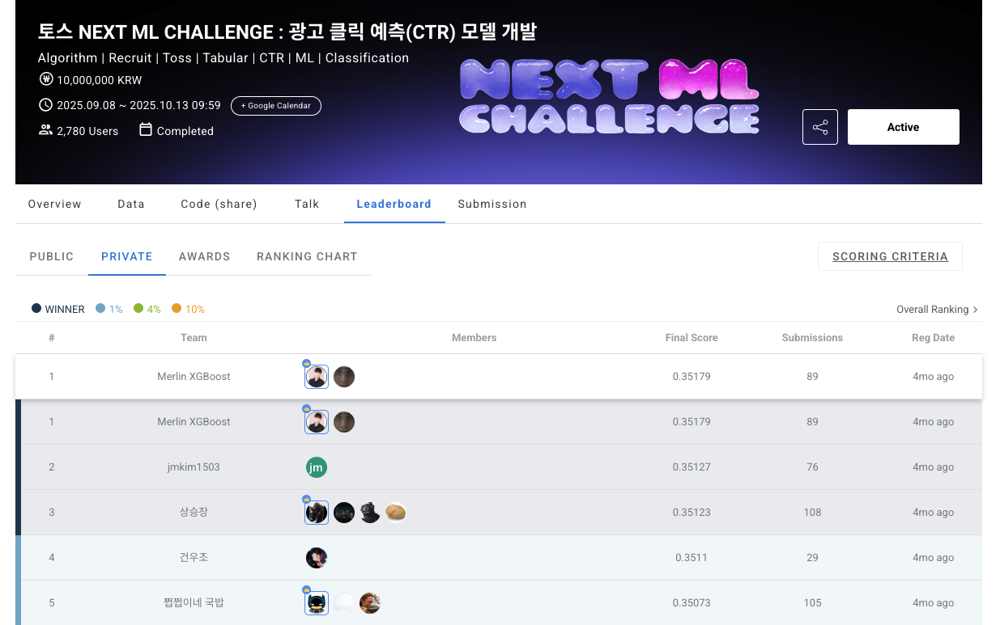

<!-- Header -->

  

<!-- Social Links -->

 

## About

Building AI products that matter.

**CTO @ Rivetta** — Designing context engineering architectures for AI-powered K-webnovel translation. While many claim LLMs have "solved" translation, real-world demands prove otherwise: readers need cultural nuance and domain expertise that raw AI cannot deliver. I architect systems that bridge this gap.

**CEO @ AlphaView** — AI-driven stock news analysis platform. (Solopreneur)

26.02 Official Launch / Reached MAU 20k

---

## What I Do

<table>
<tr>
<td width="50%" valign="top">

### Rivetta
**CTO** — K-Webnovel AI Translation

Translating Korean webnovels for the US market. LLMs alone fail to satisfy readers—lacking domain knowledge and cultural understanding. I design **context engineering architectures** that deliver translations readers actually want.

</td>
<td width="50%" valign="top">

### AlphaView
**CEO** — AI Stock Analysis

Building alphaview.kr, an AI-powered platform that analyzes stock news and market signals to help investors make informed decisions.

</td>
</tr>
</table>

---

## Background

| | Experience | Focus |
|:---:|:---|:---|
| 🧬 | **Neuroscience** | Trans-synaptic retrograde signaling research |
| 📚 | **8 Years** Literary Translation | Novels, webtoons, creative content |
| 🔧 | **3 Years** Technical Translation | Documentation, ML papers, technical specs |

> *"This domain expertise informs my approach to AI systems that truly understand context—something raw LLMs consistently fail to achieve."*

---

## Achievements

**GPU Hill Climbing Ensemble for NVIDIA Merlin Framework**
 
CTR prediction on 10M rows of real financial data (Recommender System)
 
📄 [Technical Report (EN)](https://htmlpreview.github.io/?https://github.com/shaun0927/shaun0927/blob/main/papers/Toss_Report_GPU_Hill_Climbing_Ensemble_EN.html) | [(KR)](./papers/Toss_Report_GPU_Hill_Climbing_Ensemble_KR.pdf)

  

-Top_0.01%25_(%2324)-00d084?style=flat-square)

### Competition Domains

`Recommender System` `CTR Prediction` `NLP` `Prompt Engineering` `Time Series` `Computer Vision` `Tabular ML` `Anomaly Detection`

---

## Open Source Contributions

205 PRs merged across 53 external public projects.

_Refreshed 2026-05-02 from GitHub GraphQL search. Star counts are pinned as text to avoid delayed badge-cache updates._

### Harness engineering

| Project | Description | Stars | Merged | Notes |
|:--|:--|--:|:-:|:--|
|  [oh-my-claudecode](https://github.com/Yeachan-Heo/oh-my-claudecode) | multi-agent orchestration for Claude Code | ⭐ 32,181 | [50](https://github.com/Yeachan-Heo/oh-my-claudecode/pulls?q=author%3Ashaun0927+is%3Amerged) |  |
|  [ouroboros](https://github.com/Q00/ouroboros) | workflow engine driven by specs instead of prompts | ⭐ 2,830 | [45](https://github.com/Q00/ouroboros/pulls?q=author%3Ashaun0927+is%3Amerged) |  |
|  [oh-my-codex](https://github.com/Yeachan-Heo/oh-my-codex) | hooks, agent teams, and HUDs for Codex CLI | ⭐ 27,128 | [13](https://github.com/Yeachan-Heo/oh-my-codex/pulls?q=author%3Ashaun0927+is%3Amerged) |  |
|  [zeroclaw](https://github.com/zeroclaw-labs/zeroclaw) | autonomous AI personal assistant infrastructure | ⭐ 30,874 | [5](https://github.com/zeroclaw-labs/zeroclaw/pulls?q=author%3Ashaun0927+is%3Amerged) |  |
|  [multica](https://github.com/multica-ai/multica) | managed coding-agents platform | ⭐ 23,393 | [4](https://github.com/multica-ai/multica/pulls?q=author%3Ashaun0927+is%3Amerged) |  |
|  [claude-hud](https://github.com/jarrodwatts/claude-hud) | Claude Code plugin with context/tool HUD | ⭐ 21,377 | [4](https://github.com/jarrodwatts/claude-hud/pulls?q=author%3Ashaun0927+is%3Amerged) |  |
|  [nanobot](https://github.com/HKUDS/nanobot) | lightweight personal AI agent | ⭐ 41,449 | [3](https://github.com/HKUDS/nanobot/pulls?q=author%3Ashaun0927+is%3Amerged) |  |
|  [camel](https://github.com/camel-ai/camel) | multi-agent framework | ⭐ 16,858 | [3](https://github.com/camel-ai/camel/pulls?q=author%3Ashaun0927+is%3Amerged) |  |
|  [dify](https://github.com/langgenius/dify) | platform for agentic workflow development | ⭐ 139,814 | [2](https://github.com/langgenius/dify/pulls?q=author%3Ashaun0927+is%3Amerged) |  |
|  [Flowise](https://github.com/FlowiseAI/Flowise) | visual builder for AI agents | ⭐ 52,454 | [2](https://github.com/FlowiseAI/Flowise/pulls?q=author%3Ashaun0927+is%3Amerged) |  |
|  [mempalace](https://github.com/MemPalace/mempalace) | open-source AI memory system | ⭐ 50,635 | [2](https://github.com/MemPalace/mempalace/pulls?q=author%3Ashaun0927+is%3Amerged) |  |
|  [omi](https://github.com/BasedHardware/omi) | AI wearable assistant that sees and listens | ⭐ 12,358 | [2](https://github.com/BasedHardware/omi/pulls?q=author%3Ashaun0927+is%3Amerged) |  |
|  [OpenHarness](https://github.com/HKUDS/OpenHarness) | open harness for coding agents | ⭐ 11,689 | [2](https://github.com/HKUDS/OpenHarness/pulls?q=author%3Ashaun0927+is%3Amerged) |  |
|  [GenericAgent](https://github.com/lsdefine/GenericAgent) | self-evolving generic agent framework | ⭐ 8,603 | [2](https://github.com/lsdefine/GenericAgent/pulls?q=author%3Ashaun0927+is%3Amerged) |  |
|  [goclaw](https://github.com/nextlevelbuilder/goclaw) | Go rebuild of OpenClaw with multi-tenant agent isolation | ⭐ 2,991 | [2](https://github.com/nextlevelbuilder/goclaw/pulls?q=author%3Ashaun0927+is%3Amerged) |  |
|  [lobehub](https://github.com/lobehub/lobehub) | multi-agent collaboration space | ⭐ 75,919 | [1](https://github.com/lobehub/lobehub/pulls?q=author%3Ashaun0927+is%3Amerged) |  |
|  [agno](https://github.com/agno-agi/agno) | framework for running agents as production software | ⭐ 39,844 | [1](https://github.com/agno-agi/agno/pulls?q=author%3Ashaun0927+is%3Amerged) |  |
|  [picoclaw](https://github.com/sipeed/picoclaw) | tiny deployable coding agent | ⭐ 28,646 | [1](https://github.com/sipeed/picoclaw/pulls?q=author%3Ashaun0927+is%3Amerged) |  |
|  [agent-skills](https://github.com/addyosmani/agent-skills) | engineering skills library for coding agents | ⭐ 26,924 | [1](https://github.com/addyosmani/agent-skills/pulls?q=author%3Ashaun0927+is%3Amerged) |   |
|  [haystack](https://github.com/deepset-ai/haystack) | AI orchestration framework for LLM applications | ⭐ 25,045 | [1](https://github.com/deepset-ai/haystack/pulls?q=author%3Ashaun0927+is%3Amerged) |  |
|  [mastra](https://github.com/mastra-ai/mastra) | TypeScript framework for AI apps and agents | ⭐ 23,464 | [1](https://github.com/mastra-ai/mastra/pulls?q=author%3Ashaun0927+is%3Amerged) |  |
|  [context-mode](https://github.com/mksglu/context-mode) | context-window optimization for AI coding agents | ⭐ 11,657 | [1](https://github.com/mksglu/context-mode/pulls?q=author%3Ashaun0927+is%3Amerged) |  |
|  [XcodeBuildMCP](https://github.com/getsentry/XcodeBuildMCP) | MCP server for iOS and macOS build tooling | ⭐ 5,380 | [1](https://github.com/getsentry/XcodeBuildMCP/pulls?q=author%3Ashaun0927+is%3Amerged) |  |
|  [osaurus](https://github.com/osaurus-ai/osaurus) | native macOS runtime for local LLMs | ⭐ 5,173 | [1](https://github.com/osaurus-ai/osaurus/pulls?q=author%3Ashaun0927+is%3Amerged) |  |
|  [Yuxi](https://github.com/xerrors/Yuxi) | multi-tenant agent harness with LightRAG knowledge base | ⭐ 5,064 | [1](https://github.com/xerrors/Yuxi/pulls?q=author%3Ashaun0927+is%3Amerged) |  |
|  [oh-my-pi](https://github.com/can1357/oh-my-pi) | terminal-native AI coding agent | ⭐ 3,757 | [1](https://github.com/can1357/oh-my-pi/pulls?q=author%3Ashaun0927+is%3Amerged) |  |
|  [harness](https://github.com/revfactory/harness) | meta-skill that designs domain-specific agent teams | ⭐ 3,044 | [1](https://github.com/revfactory/harness/pulls?q=author%3Ashaun0927+is%3Amerged) |  |
|  [acpx](https://github.com/openclaw/acpx) | headless CLI for Agent Client Protocol sessions | ⭐ 2,356 | [1](https://github.com/openclaw/acpx/pulls?q=author%3Ashaun0927+is%3Amerged) |  |
|  [awesome-harness-engineering](https://github.com/walkinglabs/awesome-harness-engineering) | curated list of harness engineering tools and guides | ⭐ 2,149 | [1](https://github.com/walkinglabs/awesome-harness-engineering/pulls?q=author%3Ashaun0927+is%3Amerged) |  |
|  [agentmemory](https://github.com/rohitg00/agentmemory) | persistent memory for coding agents | ⭐ 2,137 | [1](https://github.com/rohitg00/agentmemory/pulls?q=author%3Ashaun0927+is%3Amerged) |  |
|  [alphaclaw](https://github.com/chrysb/alphaclaw) | setup harness for OpenClaw | ⭐ 1,251 | [1](https://github.com/chrysb/alphaclaw/pulls?q=author%3Ashaun0927+is%3Amerged) |  |

### ML

| Project | Description | Stars | Merged | Notes |
|:--|:--|--:|:-:|:--|
|  [pytorch-grad-cam](https://github.com/jacobgil/pytorch-grad-cam) | visual explainability for CNNs and vision transformers | ⭐ 12,786 | [7](https://github.com/jacobgil/pytorch-grad-cam/pulls?q=author%3Ashaun0927+is%3Amerged) |  |
|  [FootTrafficReport](https://github.com/MSAI3rdTeam5/FootTrafficReport) | foot-traffic analytics report project | ⭐ 6 | [5](https://github.com/MSAI3rdTeam5/FootTrafficReport/pulls?q=author%3Ashaun0927+is%3Amerged) |  |
|  [PyPOTS](https://github.com/WenjieDu/PyPOTS) | toolkit for partially-observed time-series modeling | ⭐ 2,004 | [4](https://github.com/WenjieDu/PyPOTS/pulls?q=author%3Ashaun0927+is%3Amerged) |  |
|  [supervision](https://github.com/roboflow/supervision) | reusable computer vision tools | ⭐ 38,272 | [3](https://github.com/roboflow/supervision/pulls?q=author%3Ashaun0927+is%3Amerged) |  |
|  [darts](https://github.com/unit8co/darts) | time-series forecasting library | ⭐ 9,355 | [3](https://github.com/unit8co/darts/pulls?q=author%3Ashaun0927+is%3Amerged) |  |
|  [voicebox](https://github.com/jamiepine/voicebox) | open-source AI voice studio | ⭐ 24,220 | [2](https://github.com/jamiepine/voicebox/pulls?q=author%3Ashaun0927+is%3Amerged) |  |
|  [marimo](https://github.com/marimo-team/marimo) | reactive Python notebook for experiments and apps | ⭐ 20,730 | [2](https://github.com/marimo-team/marimo/pulls?q=author%3Ashaun0927+is%3Amerged) |  |
|  [anomalib](https://github.com/open-edge-platform/anomalib) | anomaly detection library | ⭐ 5,695 | [2](https://github.com/open-edge-platform/anomalib/pulls?q=author%3Ashaun0927+is%3Amerged) |  |
|  [chronos-forecasting](https://github.com/amazon-science/chronos-forecasting) | foundation models for time-series forecasting | ⭐ 5,237 | [2](https://github.com/amazon-science/chronos-forecasting/pulls?q=author%3Ashaun0927+is%3Amerged) |   |
|  [dflash](https://github.com/z-lab/dflash) | block-diffusion flash speculative decoding kernels | ⭐ 2,441 | [2](https://github.com/z-lab/dflash/pulls?q=author%3Ashaun0927+is%3Amerged) |  |
|  [PaddleOCR](https://github.com/PaddlePaddle/PaddleOCR) | OCR toolkit for structured document extraction | ⭐ 76,921 | [1](https://github.com/PaddlePaddle/PaddleOCR/pulls?q=author%3Ashaun0927+is%3Amerged) |  |
|  [VoxCPM](https://github.com/OpenBMB/VoxCPM) | tokenizer-free multilingual TTS | ⭐ 16,339 | [1](https://github.com/OpenBMB/VoxCPM/pulls?q=author%3Ashaun0927+is%3Amerged) |  |
|  [open_clip](https://github.com/mlfoundations/open_clip) | open source CLIP implementation | ⭐ 13,762 | [1](https://github.com/mlfoundations/open_clip/pulls?q=author%3Ashaun0927+is%3Amerged) |  |
|  [sktime](https://github.com/sktime/sktime) | unified framework for ML on time series | ⭐ 9,750 | [1](https://github.com/sktime/sktime/pulls?q=author%3Ashaun0927+is%3Amerged) |  |
|  [gorse](https://github.com/gorse-io/gorse) | recommender system engine | ⭐ 9,621 | [1](https://github.com/gorse-io/gorse/pulls?q=author%3Ashaun0927+is%3Amerged) |  |
|  [statsforecast](https://github.com/Nixtla/statsforecast) | fast statistical and econometric forecasting | ⭐ 4,769 | [1](https://github.com/Nixtla/statsforecast/pulls?q=author%3Ashaun0927+is%3Amerged) |  |

### Other

| Project | Description | Stars | Merged | Notes |
|:--|:--|--:|:-:|:--|
|  [PLFM_RADAR](https://github.com/NawfalMotii79/PLFM_RADAR) | 10.5 GHz phased-array radar | ⭐ 18,871 | [3](https://github.com/NawfalMotii79/PLFM_RADAR/pulls?q=author%3Ashaun0927+is%3Amerged) |  |
|  [wacli](https://github.com/steipete/wacli) | WhatsApp CLI | ⭐ 2,155 | [3](https://github.com/steipete/wacli/pulls?q=author%3Ashaun0927+is%3Amerged) |  |
|  [immich](https://github.com/immich-app/immich) | self-hosted photo and video management | ⭐ 99,430 | [1](https://github.com/immich-app/immich/pulls?q=author%3Ashaun0927+is%3Amerged) |  |
|  [openscreen](https://github.com/siddharthvaddem/openscreen) | open-source screen demo recorder | ⭐ 33,992 | [1](https://github.com/siddharthvaddem/openscreen/pulls?q=author%3Ashaun0927+is%3Amerged) |  |
|  [crawlee](https://github.com/apify/crawlee) | web scraping and browser automation library | ⭐ 23,037 | [1](https://github.com/apify/crawlee/pulls?q=author%3Ashaun0927+is%3Amerged) |  |
|  [map-to-poster](https://github.com/dimartarmizi/map-to-poster) | map-to-poster generator | ⭐ 817 | [1](https://github.com/dimartarmizi/map-to-poster/pulls?q=author%3Ashaun0927+is%3Amerged) |  |

---

<!-- TOKSCALE_START -->

## AI Coding Agent Usage

<table>
<tr><th>Platform</th><th>Models</th><th>Share</th><th>Messages</th><th>Tokens</th><th>Cost</th></tr>
<tr><td></td><td><code>opus-4-5</code> <code>haiku-4-5</code> <code>sonnet-4-5</code> <code>+4</code></td><td><code>██████████████░░░░░░</code> 69.5%</td><td align="right">292,520</td><td align="right">27.6B</td><td align="right"><b>$24,197</b></td></tr>
<tr><td></td><td><code>5.3-codex</code> <code>5.3-codex-spark</code> <code>5.4</code> <code>+2</code></td><td><code>██████░░░░░░░░░░░░░░</code> 30.5%</td><td align="right">163,956</td><td align="right">26.5B</td><td align="right"><b>$10,630</b></td></tr>
<tr><td></td><td><code>2.5-pro</code> <code>2.5-flash</code></td><td><code>█░░░░░░░░░░░░░░░░░░░</code> 0.0%</td><td align="right">19</td><td align="right">314.5K</td><td align="right"><b>$0.18</b></td></tr>
<tr><td colspan="3"><b>Total</b></td><td align="right"><b>456,495</b></td><td align="right"><b>54.1B</b></td><td align="right"><b>$34,827</b></td></tr>
</table>

**Token Composition**

Tracked by <a href="https://tokscale.ai/u/shaun0927">tokscale</a> | <a href="https://tokscale.ai/leaderboard">Leaderboard</a> | Auto-updated 2026-05-02

<!-- TOKSCALE_END -->

---

## Tech Stack

**Languages & ML**

**Backend & Data**

**Frontend**

**DevOps & Testing**

---

## GitHub Stats

  

  

  
  

